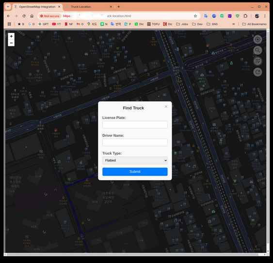
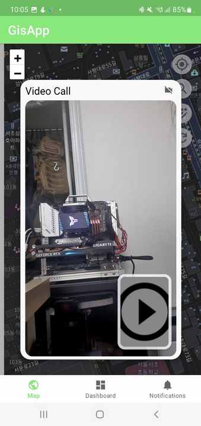
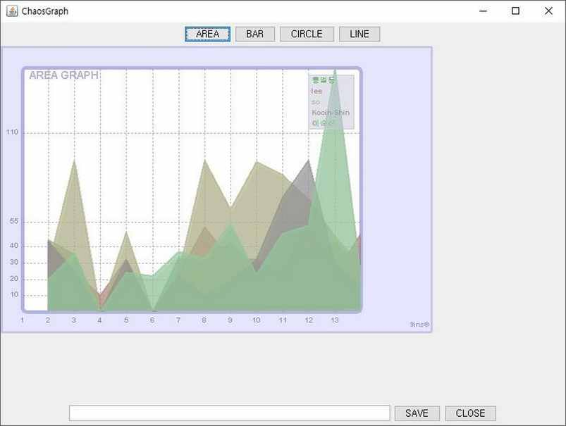
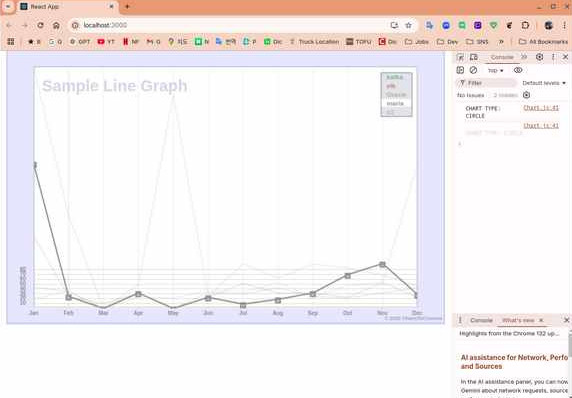
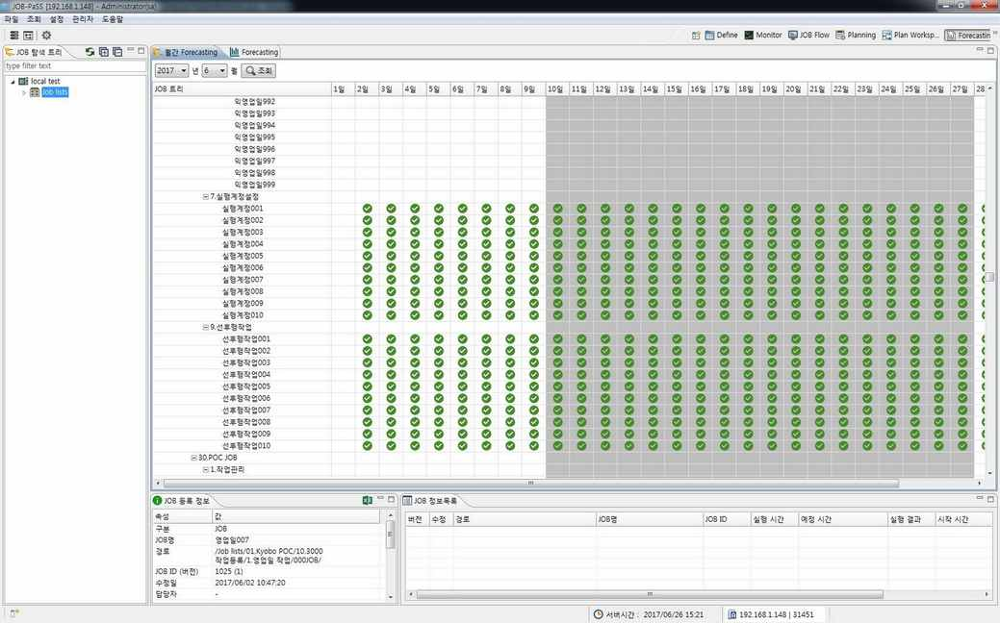
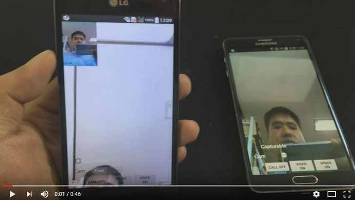
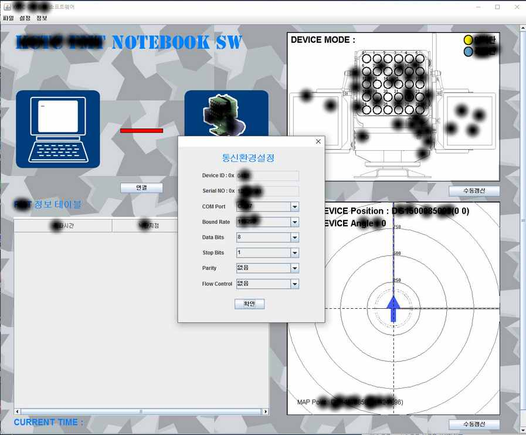

# 👨‍💻 Full Stack Developer Portfolio

## 🌐 GIS Web / App Development

Developed a Web/App using **OpenStreetMap** with:

- **Back-end**: Spring Boot
- **Platform**: Kafka
- **Database**: MySQL
- **Front-end**: OpenStreetMap API, Thymeleaf, JavaScript
- **Android**: WebView-based Android App with webcam & item registration

**Features**:
- Item display/management with markers on GIS
- Sign In / Out / User registration
- Webcam integration
- Android Native & WebView App

**Tech Stack**: `OpenStreetMap API`, `Spring Boot`, `Android`, `Javascript`, `React`

🔗 [Thymeleaf](https://www.thymeleaf.org/)

---

## 📈 ChaosGraph Java Native API

An open-source **2D charting library** for Java Swing and SWT.

- Supports chart rendering, export, and image conversion
- Aiming for future support in web UI frameworks like React/Bootstrap

**You are the author and contributor.**

🔗 [GitHub](https://github.com/9ins/chaosgraph)  
🔗 [Maven Central](https://mvnrepository.com/artifact/io.github.9ins/chaosgraph)

---

## 📊 ChaosChart JavaScript Library

JavaScript version of **ChaosGraph**, enabling frontend chart visualization.

- Compatible with React, Vue, NestJS
- Interactive user input for real-time chart updates

**Highlights**:
- Complete algorithm conversion from Java to JS
- Developed interactive components (mouse, swipe)
- Area, Bar, Line, Circle, Ratio chart types

**Tech Stack**: `JavaScript`, `HTML`, `React`

---

## 🔁 Talend Exchange

Developed advanced Talend components for integration, cloud, big data, queues, etc.

**GitHub**: [TalendExchange](https://github.com/TalendExchange)

**Components Developed**:
- `KafkaBunch`, `tKafkaBulkInput`, `tRabbitMQSubscriber`, `tRabbitMQPublisher`
- `tRedisByLettuce`, `tQuartzScheduler`, `tGTranslator`, `tActiveMQProducer`, `tActiveMQConsumer`
- `tThreadProcess`, `tJobMonitor`, `tWebCrawler`, `HttpComponents`, `AmazonSMS`

---

## 🔌 Leap Application Server

Open-source **HTTP Framework** with:

- TLS/SSL support
- RESTful services
- MSA-oriented design
- Embedded streaming (video/audio)
- Flexible file/memory resource handling

**You are the author.**

🔗 [GitHub - Leap](https://github.com/9ins/Leap)

---

## 📊 Server Monitoring UI + Backend

Used `JMX` for monitoring and `ChaosGraph` for visual components.

- Backend agent with TCP socket communication
- Developed Swing-based front-end chart UI
- Includes table metrics and log viewer

---

## 📅 JOB-PASS Gantt Chart (SWT/JFace)

For the JOB-PASS scheduling client:

- Designed interactive 2D Gantt chart
- Supported 200,000+ job elements with precision
- Scale-in/out, filtering, search, grid toggle, internal dependency

**Tech**: `SWT`, `JFace`, `RCP`

---

## 🤖 Rabbit Run Robot (Android + Arduino)

IoT project with Android & Arduino:

- Developed firmware for motor control via Bluetooth
- Created Android UI for robot interaction
- Communication via Bluetooth module

**Tech**: `Android`, `Java`, `C`, `C++`  
🎥 [Demo Video](https://www.youtube.com/watch?v=viAcpDZ9714)

---

## 💻 MyCommander Android App

Linux terminal emulator for Android:

- Input Linux commands via GUI
- Execute and display results on-screen

**Tech**: `Android`, `Java`, `Shell Script`  
🎥 [Demo Video](https://youtu.be/4_VaQtgvpXQ)

---

## 📹 Argos Video Call App (Android)

Realtime voice & video chat android app. 

- Android Native video/audio call app
- Custom `TextureView` & audio player
- Camera/audio compression + transmission
- User management & back-end integration

**Tech**: `Java`, `Android`  
🎥 [Demo Video](https://youtu.be/ocUyayUGGEs)  

---

## 🪖 Battlefield Effect Simulation Software

Military training battlefield effect controller:

- 2D minimap & device visualizer
- Full serial communication stack
- Designed entire software from scratch

**Tech**: `Java`, `Swing`, `JavaComm API (Serial)`

---

Let me know if you'd like this in a downloadable `.md` file, or if you'd like a version tailored for GitHub Pages, Notion, or a blog portfolio!
